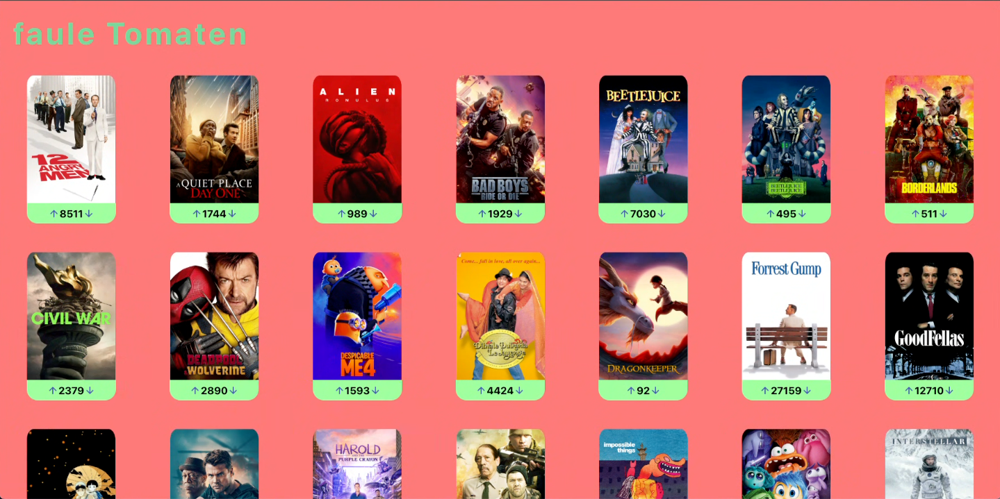
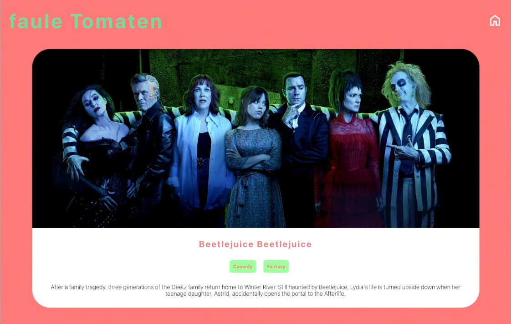

# Faule Tomaten
For this project, we built Faule Tomaten, a movie review platform. The goal was to create a multi-page application using React while consuming an external API to fetch and display movie details.

## Set Up
1.  Fork this repo
2.  Clone **and rename** this repo
4.  `cd` into the directory
5.  Install necessary dependencies with `npm install`
6.  Run your React app with `npm start`
7.  Go to `http://localhost:3000/` and you should see a page with some starter elements
8.  Enter `control + c` in your terminal to stop running the React app at any time
9. To run Cypress tests, use `npx cypress open`

## Tech Stack
- React / Router
- Css
- Cypress Testing
- External Api(rancid-tomatillos-api)

## Features
- Users can browse movies via posters
- USers can click on a movie to view its details (img ,title, genres, overview, etc.) 
- Users can vote on movies.(upvote, or downvote)
- Uses an external API to fetch data dynamically

## Main Page

## Details Page

## Contibuters

Natasha Vasquez
  
- [Github](https://github.com/nvnatasha)
- [LinkedIn](https://www.linkedin.com/in/natasha-vasquez/)

Kevin Newland

- [Github](https://github.com/kevin-newland)
- [LinkedIn](https://www.linkedin.com/in/kevin-newland/)